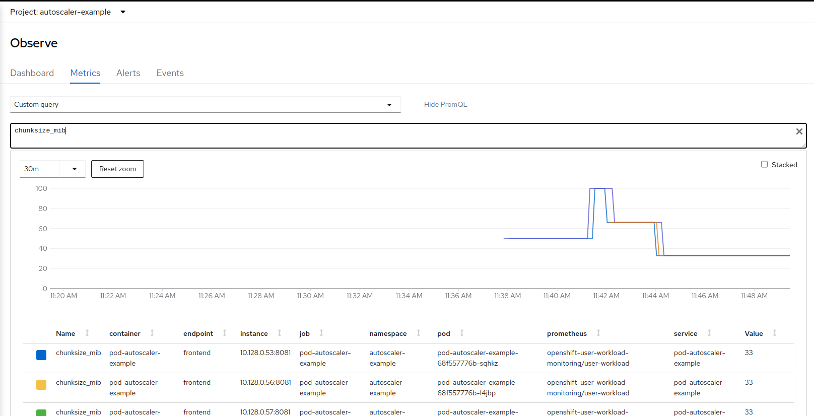

# Pod Autoscaler Example Application

This is an example application to test the pod autoscaler.

## Run locally

Check out the repository, run `make build` and start `./pod-autoscaler-example`.

It will allocate the default 100MiB of RAM and wait for additional instances to connect:

```
$ ./pod-autoscaler-example 
Can't connect to main instance at localhost:8081, assuming there is none and acting as mainWaiting for server to be responding...
Instance ID: main
Allocating 100 Mi
Instance ID: main Variable size: 100 Mi Allocated: 100 Mi
Instance ID: main Variable size: 100 Mi Allocated: 100 Mi
Instance ID: main Variable size: 100 Mi Allocated: 100 Mi
```

Starting a second instance will share the "load" across instances:

```
$ ./pod-autoscaler-example 
Instance ID: nXii9k5RhdcdwYcBKw6hRT
Can't run worker server, assuming we run on one host: listen tcp :8081: bind: address already in useAllocating 50 Mi
Instance ID: nXii9k5RhdcdwYcBKw6hRT Variable size: 50 Mi Allocated: 50 Mi
Instance ID: nXii9k5RhdcdwYcBKw6hRT Variable size: 50 Mi Allocated: 50 Mi
Instance ID: nXii9k5RhdcdwYcBKw6hRT Variable size: 50 Mi Allocated: 50 Mi
Instance ID: nXii9k5RhdcdwYcBKw6hRT Variable size: 50 Mi Allocated: 50 Mi
```

Increase the workload (this is what should trigger the autoscaler later) using curl:

```
$ curl localhost:8081/set?mem=300
```

All instances should get the new workload size now:

```
Allocating 150 Mi
Instance ID: nXii9k5RhdcdwYcBKw6hRT Variable size: 150 Mi Allocated: 150 Mi
Instance ID: nXii9k5RhdcdwYcBKw6hRT Variable size: 150 Mi Allocated: 150 Mi
Instance ID: nXii9k5RhdcdwYcBKw6hRT Variable size: 150 Mi Allocated: 150 Mi
```

Stopping the main instance will result in a re-election workflow (not too suffisticated, yet, but it should keep the workload size):

```
Error sending request to getInstanceInfo: Get "http://192.168.178.46:8082/getInstanceInfo": dial tcp 192.168.178.46:8082: connect: connection refused
Assuming main is not responding anymore. Checking who can take over.
New main: nXii9k5RhdcdwYcBKw6hRT My ID: nXii9k5RhdcdwYcBKw6hRT
Taking over...
Waiting for server to be responding...
Instance ID: main
Allocating 300 Mi
Instance ID: main Variable size: 300 Mi Allocated: 300 Mi
Instance ID: main Variable size: 300 Mi Allocated: 300 Mi
```

Since there are only two instances left, the workload per instance is increased.

A metrics endpoint is available so you can observe the application using prometheus:

```
$ curl localhost:8081/metrics
instances_count 2
workload_mib 300
chunksize_mib 150
```

## Running on OpenShift/Kubernetes

Resources in the deploy folder can be used to run it on a Kubernetes or OpenShift cluster.

The deployment in [`deploy.yaml`](deploy/deploy.yaml) will create a single instance, the service and route ([`svc.yaml`](deploy/svc.yaml) and [`route.yaml`](deploy.route.yaml)) are used to expose it.
Note that the command passes the service hostname and port to the containers so they can initiate communication when new instances come up.

The horizontal pod autoscaler in [`hpa.yaml`](deploy/hpa.yaml) will increase and decrease instances as necessary when the load increases/decreases.

Using the route, you can scale the workload with curl as shown above:

```
$ curl pod-autoscaler-example-autoscaler-example.apps.mycluster.com/set?mem=200
```

The servicemonitor in [`servicemonitor.yaml`](deploy/servicemonitor.yaml) makes the metrics available for Prometheus.
When using OpenShift, you can query them in the OpenShift console:



you can see how the chunk size first went up when the workload was increased, and then back down when the autoscaler kicked in and scaled the deployment.
